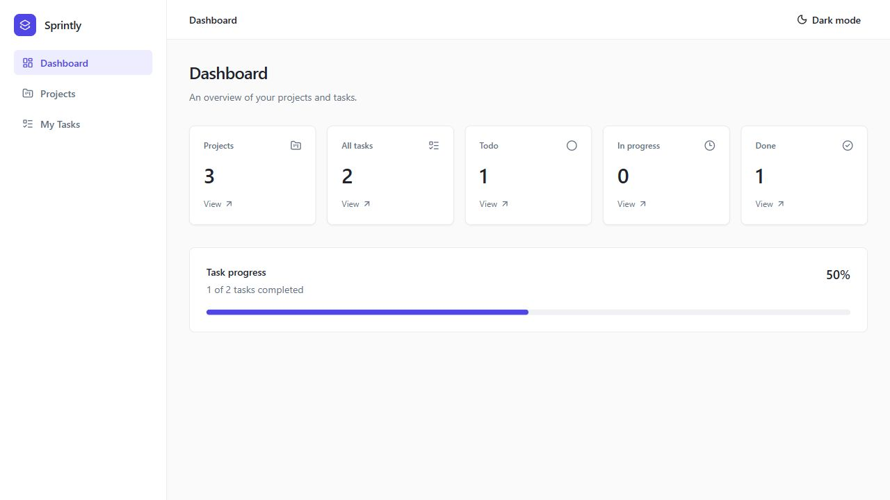
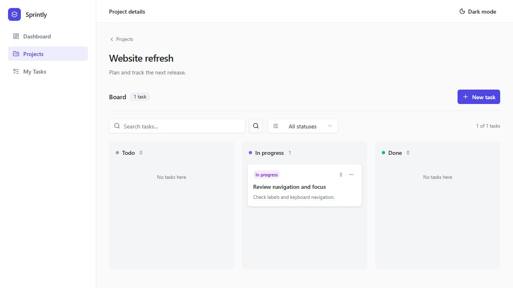
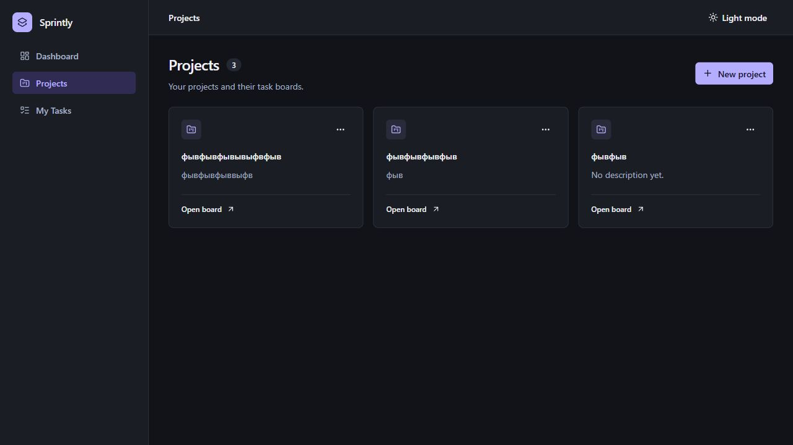

# Sprintly

A personal project and task management application built with Next.js, React, and TypeScript. Organize work into projects, track tasks on a Kanban board, and view progress across projects.

## Preview

### Dashboard



### Project board



### Projects in dark mode



## Features

- Create, edit, and delete projects and tasks.
- Open a dedicated project page with a three-column Kanban board.
- Move tasks between Todo, In progress, and Done using drag and drop or the task action menu.
- Search tasks by title and filter by status, with filters preserved in URL parameters.
- Browse tasks across projects on the My Tasks page.
- View project counts, task status totals, and completion progress on the dashboard.
- Store data in SQLite and update cached API data with RTK Query.
- Use a responsive interface with persistent light and dark theme preferences.
- Receive validation messages, loading states, and request error feedback.

## Tech stack

| Area | Technologies |
| --- | --- |
| Application | Next.js 16 App Router, React 19, TypeScript |
| API and caching | Redux Toolkit, React Redux, RTK Query |
| Backend | Next.js Route Handlers |
| Storage | SQLite, better-sqlite3 |
| Interface | Tailwind CSS 4, shadcn/ui, Radix UI, Lucide icons |

## Getting started

Requirements: Node.js 22 or later and npm. The app uses a native SQLite dependency; it needs a Node.js environment, not an Edge runtime.

```sh
git clone https://github.com/Delax3144/sprintly.git
cd sprintly
npm ci
npm run dev
```

Open [localhost:3000](http://localhost:3000).

No environment variables or external database service are required for local development. The database file, `data/sprintly.db`, and its tables are created automatically on the first API request. Database files are excluded from Git. A fresh checkout starts with no projects or tasks.

To try the app, create a project, open its board, add a task, and move it to another status. The dashboard updates after the change.

### Production build

```sh
npm run build
npm start
```

### Code checks

```sh
npm run lint
npm run build
git diff --check
```

The production build also checks TypeScript. Automated tests are a planned next step.

## How it works

- **Pages and layouts:** App Router provides the dashboard shell, project list, individual project pages, and My Tasks page.
- **Local UI state:** React manages form inputs and dialog state.
- **Server data:** RTK Query manages requests and caching. Mutations invalidate related task, project, and dashboard data.
- **Filtering:** Search and status filters live in URL parameters, so filtered views can be bookmarked and restored.
- **Persistence:** Route Handlers validate request bodies and use parameterized SQLite queries. Tasks belong to projects through a foreign key; deleting a project also deletes its tasks.
- **Shared UI:** Components in `components/ui` provide consistent controls, dialogs, and menus. Shared CSS variables define the light and dark palettes.

```text
app/
    (dashboard)/     Pages and shared application layout
    api/             Project, task, and dashboard endpoints
    StoreProvider.tsx
components/
    layout/          Navigation, header, and theme toggle
    projects/        Project cards, forms, and details
    tasks/           Task forms and Kanban board
    ui/              Shared shadcn/ui components
lib/
    services/        RTK Query API definitions
    db.ts            SQLite initialization
    store.ts         Redux store setup
types/               Project, task, and dashboard types
```

## API

| Method | Endpoint | Purpose |
| --- | --- | --- |
| GET | `/api/dashboard` | Project and task statistics |
| GET, POST | `/api/projects` | List and create projects |
| GET, PATCH, DELETE | `/api/projects/[id]` | Read, update, and delete a project |
| GET, POST | `/api/projects/[id]/tasks` | List and create tasks within a project |
| GET | `/api/tasks` | List tasks with their project titles |
| PATCH, DELETE | `/api/tasks/[id]` | Update task details or status, and delete a task |

## Current scope and deployment

Sprintly is a personal portfolio project. Authentication, user accounts, and access control are not implemented; data is shared within one application instance.

Deployment requires a Node.js server with a writable, persistent disk for SQLite. An ephemeral filesystem will not preserve the database across deployments or restarts. Keep a hosted demo's data disposable while access control is absent.

Dragging changes a task's status. Custom ordering within a column is not persisted.

## Next steps

- Add automated tests for core project and task workflows.
- Deploy a demo with persistent storage.
- Introduce authentication and per-user data access.
